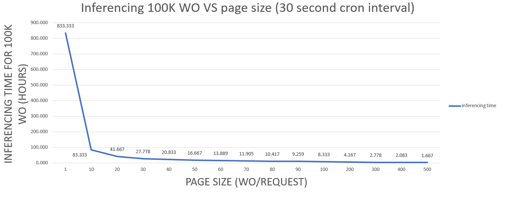
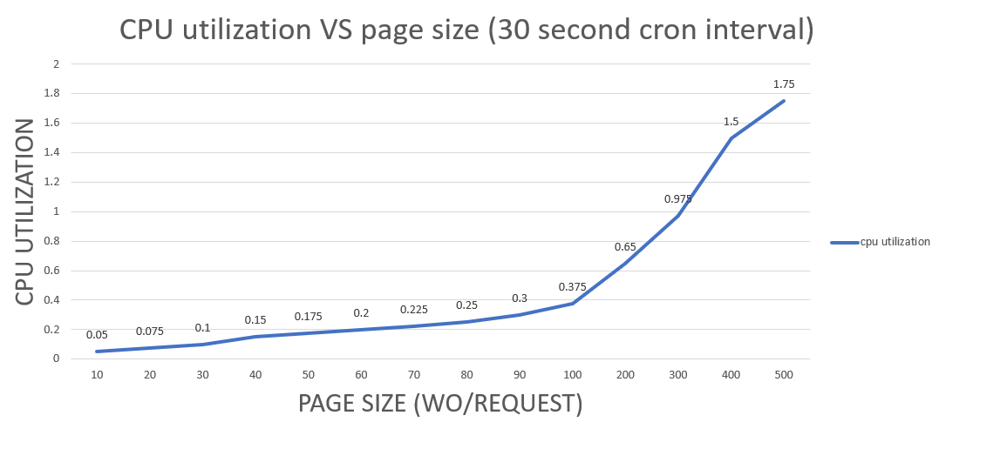
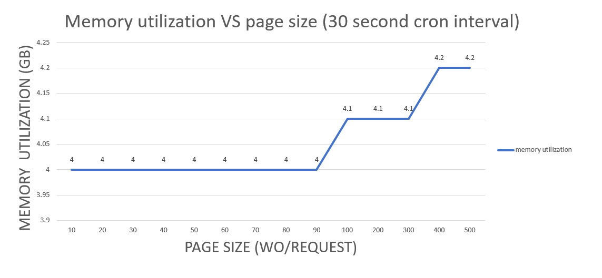

# Work Order Intelligence Inferencing
This was added to the MAS Manage application to assist users with problem code classification (PCC) for Work Orders. See the product documentation for more details.

## PCC model inferencing (batch mode from cron task)
Inferencing is typically run more frequently than training, but is less resource intensive. By default, MAS Manage is configured with a single instance of the AIINFJOB cron task. This is recommended for most workloads.

The predictor pod where inferencing/prediction occurs receives a batch of Work Orders to be inferenced from the MAS Manage cron pod running the AIINFJOB cron task. The batch size (or page size, defined on the MXAPIWODETAIL object structure query template) is the best way to control the rate at which Work Orders are inferenced. In the graph below you can see how the total time to inference 100K work orders is influenced by the batch size. With a batch size of 500 Work Orders/request and a 30 second interval for the AIINFJOB cron task 100K work orders were inferenced in approximately 1.6 hours. Compared to a batch size of 10 WO/request which took 83 hours.

!!! Important
    The recommended batch size is 500 Work Orders/request and the recommended interval for the AIINFJOB cron task is 30 seconds.

## PCC model inferencing required resources (batch mode from cron task)
The graphs below show the CPU and memory resource utilization of the predictor pod based on the batch size. As you can see, the CPU utilization of the predictor pod increases with the batch size, but the memory utilization remains fairly consistent (i.e. between 4GB - 5GB)

## PCC model inferencing: batch cron processing vs on-demand single inference
For bulk inferencing of large numbers of Work Orders it is recommended to use the AIINFJOB cron task. However, UI users can also request problem code inferencing on a single work order. In this case the predictor pod will receive a single work order and as a result the overhead of processing a single work order is much higher.  For example, to inference a batch of 10 or more work orders will result in an average inferencing time of 20 milliseconds per work order in the predictor pod, but the inference time for a single work order from the UI is about 120 milliseconds (in the predictor pod). The total time including the MAS Manage API request is about 750 milliseconds. It is therefore much more efficient to inference large numbers of work orders asynchronously using the AIINFJOB cron task and a page size of 500. In other words, don't use the API from a script.
