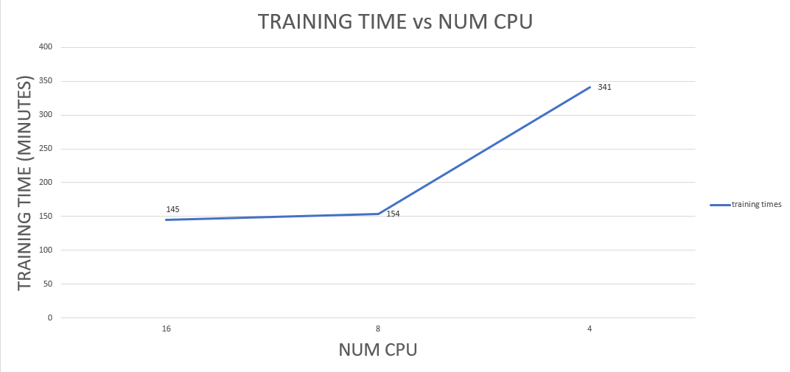
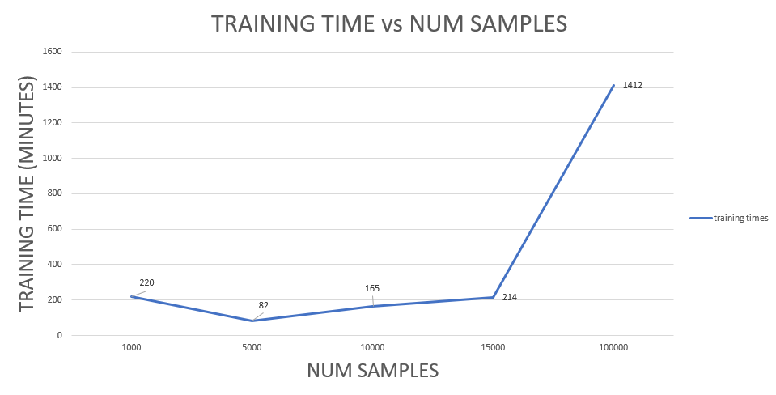

# Work Order Intelligence Training
This was added to the MAS Manage application to assist users with problem code classification (PCC) for Work Orders. See the product documentation for more details.

## PCC model training required resources
Model training is resource intensive. For this reason there is a limit of one active model training per MAS Manage instance.

A single model training requires at least 8GB of memory. The pipeline pod, where model training occurs, will allocate a number of busy processes equal to the number of CPU on the worker node where the pod is scheduled. At the time of this writing there is no CPU limit set for the pipeline pod, so it will consume as much CPU resources as are  available on the worker node where it is scheduled. In general, the more CPU is available to the pipeline pod the faster training time will go.

The three data points on the graph below were taken on a 16 CPU worker node. In the tests below a cpu limit was placed on the pipeline pod (not the default, i.e. by default the pipeline pod does not have specified limits). As you can see the training time with an 8 CPU limit was a little more than twice as fast as the training time with a 4 CPU limit.  However, when comparing the 16 CPU limit and 8 CPU limit training time, there is very little improvement. This can be attributed to the fact that there were other workloads running on the worker node where the pipeline pod was scheduled and as well as synchronization waits between the training processes/threads. In other words, to improve the training time for the 16 cpu limit test it would be necessary to schedule the pipeline pod on a worker node with more than 16 CPU and fewer competing workloads.

## Sample sizes for PCC model training

!!! important
    Do not train with more than 10K labeled samples. 10K samples is the recommended limit for PCC training.

The training times for a single epoch and different sample sizes are shown below. In general, the larger the size of the labeled sample data set, the longer the training time will be. You can see below there is an
exception to this rule.  When comparing the single epoch training time between the 1K sample size and the 5K sample size, you can see that the single epoch training time for 5K sample size is only 82 minutes compared to 220 minutes for the 1K sample size. This is due to the fact that there were 30 problem codes in this test and with 1K sample size there were an insufficient number of samples per problem code. As a result, the model leveraged Watson X to generate synthetic samples and this process accounts for the additional training time for the 1K sample set.

!!! info
    The results below show training time for a single epoch. For a real training, 12 epochs is used and therefore the single epoch training times below should be multiplied by 12 to get the real training time. Note, there is a default timeout of 14400 minutes (or 10 days) for training to complete.

