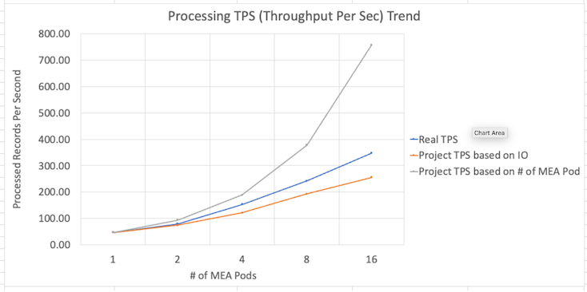

# MAS Manage MIF/JMS

## Lab Result Highlights

-  The lab results indicate a significant correlation between the transaction per second (TPS) and database disk IO utilization. This correlation suggests that the level of transactional activity directly impacts the IO workload on the database disk. Conversely, the IO workload acts as a limitation on the system's ability to handle a larger volume of transactions.

-  When IO is not the limiting factor, increasing the number of MEA Pods can positively impact the processing performance.

-  Increasing the Message-Driven Bean (MDB) instances can potentially have a positive impact on system performance. It is recommended to adjust the number of records per message, the # of MDB and the batch size. By finding the right balance, you can target a resource usage of around 2 cores and 4-7GB of RAM that can help ensure efficient utilization without overburdening the MEA pods.

- Based on the lab results, it has been observed that a large number of internal error messages have a substantial impact on processing throughput.

- Under a certain circumstance, the configuration parameter mxe.int.splitdataonpost does not demonstrate a positive impact. To validate its effectiveness, it is recommended to perform a dry run in your specific environment for verification.

## Performance Troubleshooting Checklist

To troubleshoot and optimize performance, follow this checklist:

- Ensure adherence to best practices for optimizing performance in your DB, Openshift, and MAS environments.
- Monitor disk IO utilization of the database and maintain it within acceptable limits to avoid performance degradation due to saturated disk resources.
- Adjust the number of records per message and the MDB/batch size to effectively manage resource utilization of MEA pods. Aim for a resource consumption range of approximately 2 cores and 4-7 GB.
- Regularly check the message queue to prevent it from becoming empty, ensuring a steady flow of messages for processing.
- Minimize the occurrence of integration error messages as they can significantly impact processing throughput. Pay attention to a high volume of internal error messages and investigate the message reprocessing application for further insights.
- Set a sufficiently large value for `maxMessageDepth` to avoid message queue overflow. It is recommended to match SIBus's default value of at least 500,000.
- When the need for additional MEA pods arises, consider scaling up the number of worker nodes to accommodate the increased demand effectively.

## Test Methodologies

- Establish a monitoring system to track essential performance metrics throughout the testing process.

- Begin with a dry run using a single MEA pod to establish a baseline benchmark for performance evaluation.

- Adjust the Message-Driven Bean (MDB) and BatchSize parameters to optimize resource utilization within an appropriate range for the MEA pod.

- Scale up the number of MEA pods as needed to meet performance requirements and accommodate increased workload.

- Continuously monitor and assess the performance of both the database and the application to identify any bottlenecks or areas for improvement.

By following these test methodologies, you can effectively monitor and optimize the performance of your system, ensuring efficient resource utilization and maintaining satisfactory levels of performance.

## Major Performance Related Factors for MIF
| Component   | Configuration                                        | Adjustable or Scalable                 | Observeration & Best   Practice                                                                                                                     |
|-------------|------------------------------------------------------|----------------------------------------|-----------------------------------------------------------------------------------------------------------------------------------------------------|
| JMS /   MIF | maxMessageDepth                                      | Yes                                    | Make it large enough. If it is   too small, when the queue is full, the process fails and may be hard to   recover. Recommend 500,000 same as SIBus |
|             | maxEndpoints                                         | Yes                                    | Limit the maxConcurrency                                                                                                                            |
|             | MDB(maxConcurrency)                                  | Yes                                    | Alone with BatchSize will   impact processing speed and MEA pods resouce utliitzation                                                               |
|             | BatchSize(maxBatchSize)                              | Yes                                    | Alone with MDB will impact   processing speed and MEA pods resouce utliitzation                                                                     |
| Maximo      | #   of JMS Pod                                       | Yes                                    | 1 JMS Server works well in   benchmark test. It does not consume a significant resource                                                             |
|             | # of MEA Pod                                         | Yes                                    | Able to linear scale                                                                                                                                |
|             | MEA CPU / MEM   Usage                                | Yes                                    | Adjust JMS/MDB and BatchSize to   control MEA pods resources in a reasonable range e.g. (2 - 3 core / 4 -7G)                                        |
|             | JMS CPU / MEM   Usage                                | Yes                                    | Default setting works well in   the benchmark test                                                                                                  |
|             | DB CPU / MEM   Usage                                 | Yes                                    | Ensure DB has sufficient   resource                                                                                                                 |
|             | DB Disk IO Util   %                                  | Yes, but sometime it is hard to adjust | Disk IO throughput is critial   for the overall processing                                                                                          |
|             | DB Lock Holds                                        | N/A                                    |                                                                                                                                                     |
|             | DB Tuning: Long   Running Query, # of Appl, Memory.. | Yes                                    | Follow the best practice to   tune DB                                                                                                               |
|             | Maximo Sequence   Cache                              | Yes                                    | a reasonable # e.g. 20 or 50   can reduce the db cpu and processing time                                                                            |
|             | mxe.int.splitdataonpost                              | Yes                                    |                                                                                                                                                     |
| Message     | #   of record per Message                            | Yes                                    |                                                                                                                                                     |
|             | data structure   (complexity of the record)          | N/A                                    | Impacts performance because of   business logic check                                                                                               |
|             | Record Quality   (record cannot be processed)        | Yes                                    | A large amount of int error   messages slow down the overall processing speed                                                                       |
| Misc        | Method   & Speed to post message into queue          | Yes                                    | Ensure message post (writing to   queue) as fast as possible. A slow pacing lowes the env processing capacity.                                      |
|             | Any other   concurrent transactions                  | N/A                                    | other concurrency workloads   impact the processing time                                                                                            |
|             | Worker Node   Capacity                               | Yes                                    | Worker Node Capacity may limit   working pod (e.g. MEA) capacity. Pod distribution should also be considered.               

