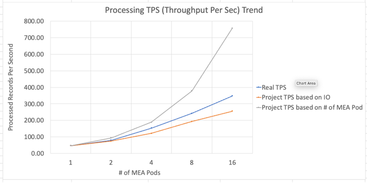

# MAS Manage MIF/JMS

## Lab Result Highlights

-  The lab results indicate a significant correlation between the transaction per second (TPS) and database disk IO utilization. This correlation suggests that the level of transactional activity directly impacts the IO workload on the database disk. Conversely, the IO workload acts as a limitation on the system's ability to handle a larger volume of transactions.


-  When IO is not the limiting factor, increasing the number of MEA Pods can positively impact the processing performance.

-  Increasing the Message-Driven Bean (MDB) instances can potentially have a positive impact on system performance. It is recommended to adjust the number of records per message, the # of MDB and the batch size. By finding the right balance, you can target a resource usage of around 2 cores and 4-7GB of RAM that can help ensure efficient utilization without overburdening the MEA pods.

- Based on the lab results, it has been observed that a large number of internal error messages have a substantial impact on processing throughput.

- Under a certain circumstance, the configuration parameter mxe.int.splitdataonpost does not demonstrate a positive impact. To validate its effectiveness, it is recommended to perform a dry run in your specific environment for verification.

## Performance Troubleshooting Checklist

To troubleshoot and optimize performance, follow this checklist:

- Ensure adherence to best practices for optimizing performance in your DB, Openshift, and MAS environments.
- Monitor disk IO utilization of the database and maintain it within acceptable limits to avoid performance degradation due to saturated disk resources.
- Adjust the number of records per message and the MDB/batch size to effectively manage resource utilization of MEA pods. Aim for a resource consumption range of approximately 2 cores and 4-7 GB.
- Regularly check the message queue to prevent it from becoming empty, ensuring a steady flow of messages for processing.
- Minimize the occurrence of integration error messages as they can significantly impact processing throughput. Pay attention to a high volume of internal error messages and investigate the message reprocessing application for further insights.
- Set a sufficiently large value for `maxMessageDepth` to avoid message queue overflow. It is recommended to match SIBus's default value of at least 500,000.
- When the need for additional MEA pods arises, consider scaling up the number of worker nodes to accommodate the increased demand effectively.
- Make sure the JMS pod is writing/reading to disk storage with 10 MB/s IOPs write throughput and sub-millisecond average and median disk write latency. Here are directions for checking the performance of your JMS pod:
    - Find the pod name of the JMS pod: ```oc -n mas-masinst1-manage get pods -l "mas.ibm.com/appTypeName=jms" -o jsonpath='{range .items[*]}{.metadata.name}{"\n"}{end}'```
    - Create a file called `disk-iops-and-latency-test.py` that contains the following content:
```python
#!/usr/bin/env python3
"""
Disk Write IOPS and Latency Tester for Linux
Tests random write performance with configurable parameters
"""

import os
import sys
import time
import statistics

def test_disk_performance(filename, iterations=1000, block_size=4096, use_direct_io=True):
    """
    Test disk write IOPS and latency
    
    Args:
        filename: Path to test file
        iterations: Number of write operations
        block_size: Size of each write in bytes (default 4KB)
        use_direct_io: Use O_DIRECT to bypass cache (default True)
    """
    latencies = []
    
    # Open file with appropriate flags
    flags = os.O_WRONLY | os.O_CREAT | os.O_TRUNC
    if use_direct_io:
        flags |= os.O_DIRECT | os.O_SYNC
    
    try:
        fd = os.open(filename, flags)
    except OSError as e:
        print(f"Error opening file: {e}")
        print("Note: O_DIRECT may require block-aligned I/O or may not be supported on all filesystems")
        return
    
    # Prepare data buffer (must be aligned for O_DIRECT)
    data = b'x' * block_size
    
    print("Testing disk write performance...")
    print(f"File: {filename}")
    print(f"Block size: {block_size} bytes")
    print(f"Iterations: {iterations}")
    print(f"Direct I/O: {use_direct_io}")
    print("\nRunning test...\n")
    
    # Measure total time and individual write latencies
    start_time = time.perf_counter()
    
    for i in range(iterations):
        write_start = time.perf_counter()
        try:
            os.write(fd, data)
        except OSError as e:
            print(f"Write error at iteration {i}: {e}")
            break
        write_end = time.perf_counter()
        latencies.append((write_end - write_start) * 1000)  # Convert to ms
        
        # Progress indicator every 100 iterations
        # if (i + 1) % 100 == 0:
        #     print(f"Progress: {i + 1}/{iterations} writes completed")
    
    total_time = time.perf_counter() - start_time
    os.close(fd)
    
    # Calculate metrics
    if not latencies:
        print("No successful writes completed")
        return
    
    iops = len(latencies) / total_time
    avg_latency = statistics.mean(latencies)
    median_latency = statistics.median(latencies)
    stdev_latency = statistics.stdev(latencies) if len(latencies) > 1 else 0
    min_latency = min(latencies)
    max_latency = max(latencies)
    
    # Calculate percentiles
    sorted_latencies = sorted(latencies)
    p50 = sorted_latencies[int(len(sorted_latencies) * 0.50)]
    p95 = sorted_latencies[int(len(sorted_latencies) * 0.95)]
    p99 = sorted_latencies[int(len(sorted_latencies) * 0.99)]
    p999 = sorted_latencies[int(len(sorted_latencies) * 0.999)]
    
    # Calculate throughput
    total_bytes = len(latencies) * block_size
    throughput_mbs = (total_bytes / (1024 * 1024)) / total_time
    
    # Print results
    print("="*60)
    print("DISK WRITE PERFORMANCE RESULTS")
    print("="*60)
    print("\nIOPS Metrics:")
    print(f"  Write IOPS:           {iops:,.2f} ops/sec")
    print(f"  Throughput:           {throughput_mbs:.2f} MB/s")
    print(f"  Total operations:     {len(latencies):,}")
    print(f"  Total time:           {total_time:.2f} seconds")
    print(f"  Total data written:   {total_bytes / (1024*1024):.2f} MB")
    
    print("\nLatency Metrics (milliseconds):")
    print(f"  Average:              {avg_latency:.3f} ms")
    print(f"  Median (P50):         {median_latency:.3f} ms")
    print(f"  Std Deviation:        {stdev_latency:.3f} ms")
    print(f"  Minimum:              {min_latency:.3f} ms")
    print(f"  Maximum:              {max_latency:.3f} ms")
    
    print("\nLatency Percentiles:")
    print(f"  P50 (median):         {p50:.3f} ms")
    print(f"  P95:                  {p95:.3f} ms")
    print(f"  P99:                  {p99:.3f} ms")
    print(f"  P99.9:                {p999:.3f} ms")
    print("="*60)
    
    # Cleanup
    try:
        os.remove(filename)
        print(f"\nTest file removed: {filename}")
    except OSError:
        print(f"\nWarning: Could not remove test file: {filename}")

def main():
    # Parse command line arguments
    if len(sys.argv) < 2:
        print("Usage: python3 disk_test.py <test_file_path> [iterations] [block_size]")
        print("\nExample:")
        print("  python3 disk_test.py /tmp/test_file 1000 4096")
        print("\nArguments:")
        print("  test_file_path: Path where test file will be created")
        print("  iterations:     Number of write operations (default: 1000)")
        print("  block_size:     Size of each write in bytes (default: 4096)")
        print("  use_direct_io:  Specify 0 to disable use Direct IO (default: 1)")
        sys.exit(1)
    
    filename = sys.argv[1]
    iterations = int(sys.argv[2]) if len(sys.argv) > 2 else 1000
    block_size = int(sys.argv[3]) if len(sys.argv) > 3 else 4096
    use_direct_io = int(sys.argv[4]) if len(sys.argv) > 4 else 1
    if use_direct_io == 1:
        use_direct_io = True
    else:
        use_direct_io = False
    
    # Run the test
    test_disk_performance(filename, iterations, block_size, use_direct_io)

if __name__ == "__main__":
    main()
```

- Make the script executable: `chmod +x disk-iops-and-latency-test.py`
- Copy this file to the /tmp directory on the JMS pod: ```oc -n <mas_manage_namespace> cp disk-iops-and-latency-test.py <manage_jms_pod_name>:/tmp/disk-iops-and-latency-test.py```
- Run the script using oc exec: ```oc -n <mas_manage_namespace> exec -it <manage_jms_pod_name> -- /tmp/disk-iops-and-latency-test.py /jms/write-test.out 1000 4096```
- You should see output similar to this (although, the numbers were almost certainly be different, of course):
```bash
============================================================
DISK WRITE PERFORMANCE RESULTS
============================================================

IOPS Metrics:
  Write IOPS:           2,076.37 ops/sec
  Throughput:           8.11 MB/s
  Total operations:     1,000
  Total time:           0.48 seconds
  Total data written:   3.91 MB

Latency Metrics (milliseconds):
  Average:              0.480 ms
  Median (P50):         0.499 ms
  Std Deviation:        0.064 ms
  Minimum:              0.342 ms
  Maximum:              1.054 ms

Latency Percentiles:
  P50 (median):         0.500 ms
  P95:                  0.549 ms
  P99:                  0.601 ms
  P99.9:                1.054 ms
============================================================
```
- The fields to play attention to are the "Write IOPS" and "Average" and "Median" Latency Metrics.
- If you get an error like this while running it:
```bash
Write error at iteration 0: [Errno 22] Invalid argument
```
you may be testing storage that does not support Direct I/O, so you will need to call the script like this:
```bash
oc -n mas-masinst1-manage exec -it masinst1-tenant1-jms-0 -- /tmp/disk-iops-and-latency-test.py /jms/write-test.out 1000 4096 0
```
The additional "0" argument at the end disables Direct I/O.


## Test Methodologies

- Establish a monitoring system to track essential performance metrics throughout the testing process.

- Begin with a dry run using a single MEA pod to establish a baseline benchmark for performance evaluation.

- Adjust the Message-Driven Bean (MDB) and BatchSize parameters to optimize resource utilization within an appropriate range for the MEA pod.

- Scale up the number of MEA pods as needed to meet performance requirements and accommodate increased workload.

- Continuously monitor and assess the performance of both the database and the application to identify any bottlenecks or areas for improvement.

By following these test methodologies, you can effectively monitor and optimize the performance of your system, ensuring efficient resource utilization and maintaining satisfactory levels of performance.

## Major Performance Related Factors for MIF
| Component   | Configuration                                        | Adjustable or Scalable                 | Observeration & Best   Practice                                                                                                                     |
|-------------|------------------------------------------------------|----------------------------------------|-----------------------------------------------------------------------------------------------------------------------------------------------------|
| JMS /   MIF | maxMessageDepth                                      | Yes                                    | Make it large enough. If it is   too small, when the queue is full, the process fails and may be hard to   recover. Recommend 500,000 same as SIBus |
|             | maxEndpoints                                         | Yes                                    | Limit the maxConcurrency                                                                                                                            |
|             | MDB(maxConcurrency)                                  | Yes                                    | Alone with BatchSize will   impact processing speed and MEA pods resouce utliitzation                                                               |
|             | BatchSize(maxBatchSize)                              | Yes                                    | Alone with MDB will impact   processing speed and MEA pods resouce utliitzation                                                                     |
| Maximo      | #   of JMS Pod                                       | Yes                                    | 1 JMS Server works well in   benchmark test. It does not consume a significant resource                                                             |
|             | # of MEA Pod                                         | Yes                                    | Able to linear scale                                                                                                                                |
|             | MEA CPU / MEM   Usage                                | Yes                                    | Adjust JMS/MDB and BatchSize to   control MEA pods resources in a reasonable range e.g. (2 - 3 core / 4 -7G)                                        |
|             | JMS CPU / MEM   Usage                                | Yes                                    | Default setting works well in   the benchmark test                                                                                                  |
|             | DB CPU / MEM   Usage                                 | Yes                                    | Ensure DB has sufficient   resource                                                                                                                 |
|             | DB Disk IO Util   %                                  | Yes, but sometime it is hard to adjust | Disk IO throughput is critial   for the overall processing                                                                                          |
|             | DB Lock Holds                                        | N/A                                    |                                                                                                                                                     |
|             | DB Tuning: Long   Running Query, # of Appl, Memory.. | Yes                                    | Follow the best practice to   tune DB                                                                                                               |
|             | Maximo Sequence   Cache                              | Yes                                    | a reasonable # e.g. 20 or 50   can reduce the db cpu and processing time                                                                            |
|             | mxe.int.splitdataonpost                              | Yes                                    |                                                                                                                                                     |
| Message     | #   of record per Message                            | Yes                                    |                                                                                                                                                     |
|             | data structure   (complexity of the record)          | N/A                                    | Impacts performance because of   business logic check                                                                                               |
|             | Record Quality   (record cannot be processed)        | Yes                                    | A large amount of int error   messages slow down the overall processing speed                                                                       |
| Misc        | Method   & Speed to post message into queue          | Yes                                    | Ensure message post (writing to   queue) as fast as possible. A slow pacing lowes the env processing capacity.                                      |
|             | Any other   concurrent transactions                  | N/A                                    | other concurrency workloads   impact the processing time                                                                                            |
|             | Worker Node   Capacity                               | Yes                                    | Worker Node Capacity may limit   working pod (e.g. MEA) capacity. Pod distribution should also be considered.               


