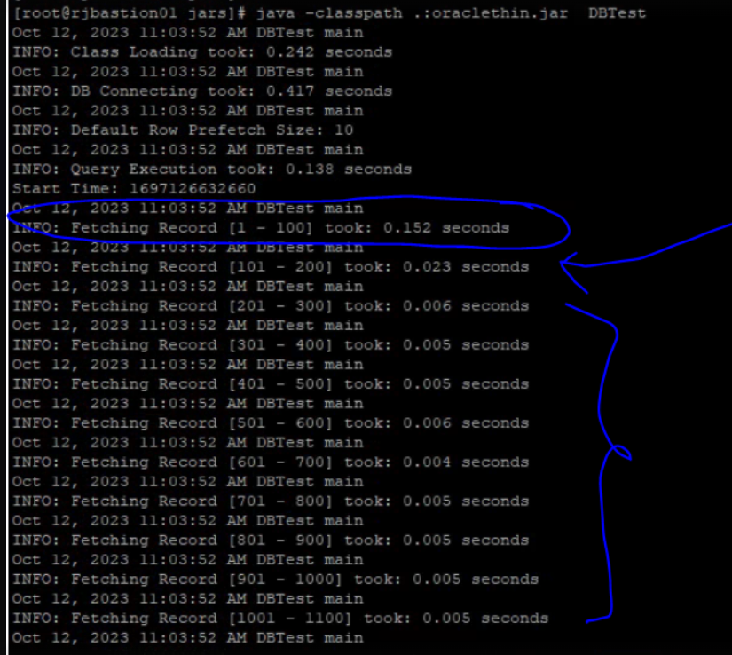
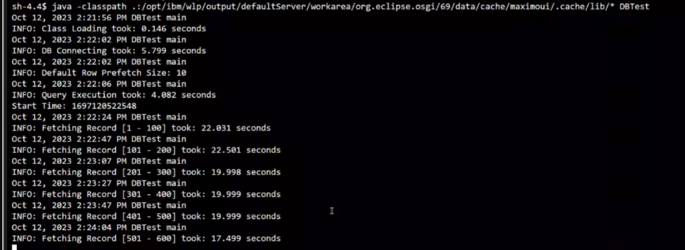

# DBTest Utility

**notes:** This utility requires **Java version 11 or higher**.

The DBTest Utility has two modes:

**Benchmark Mode (the default):** is to measure database connection time, query execution time and data fetching time for every 100 records. 

**Query Mode:** is to display the query result with database connection time, query execution time and data fetching time. 


Here is an example demonstrating how to utilize this utility in the Maximo UI pod.

### Run DBTest in MAS Manage maxinst pod

- go to maxinst pod in the MAS Manage namespace -> terminal tab, then execute below commands:

```
cd /tmp
curl -L -v -o run-dbtest-in-maxinst-pod.sh https://ibm-mas.github.io/mas-performance/pd/download/DBTest/run-dbtest-in-maxinst-pod.sh
bash run-dbtest-in-maxinst-pod.sh
```

### Run DBTest in Maximo UI Pod

- go to maximo ui pod -> terminal tab, then execute below commands:

```bash
# change to /tmp
cd /tmp

# download DBTest
curl -L -v -o DBTest.class https://ibm-mas.github.io/mas-performance/pd/download/DBTest/DBTest.class

# set DBURL. If this utility is in maximo UI pod, set DBURL="$MXE_DB_URL"
export DBURL="<jdbc url>" or export DBURL="$MXE_DB_URL" or export DBURL="${MXE_DB_URL}sslTrustStoreLocation=${java_truststore};sslTrustStorePassword=${java_truststore_password};"
export DBUSERNAME='<username>'
export DBPASSWORD='<password>'
export SQLQUERY='select * from maximo.maxattribute'

# execute the utility in benchmark mode
java -classpath .:$(dirname "$(find /opt | grep "oraclethin.jar" | head -n 1)")/* DBTest
```

**Result Samples:**

Given optimal network latency and a healthy database status, the expected data fetching time is less than 10 milliseconds.

**Good Result:**


**Bad Result:**



### Execute the utility in query mode

```bash
java -classpath .:$(dirname "$(find /opt | grep "oraclethin.jar" | head -n 1)")/* DBTest -q
```

**Output Sample:**

```text
(base) [~/javatool]$ java -classpath .:./lib/* DBTest -q
Dec. 06, 2023 11:49:47 A.M. DBTest getConnection
INFO: Loading Class took: 0.029 seconds
Dec. 06, 2023 11:49:53 A.M. DBTest getConnection
INFO: DB Connecting took: 6.55 seconds
Dec. 06, 2023 11:49:53 A.M. DBTest printResult
INFO: Query Execution took: 0.099 seconds
APP, OPTIONNAME, DESCRIPTION, ESIGENABLED, VISIBLE, ALSOGRANTS, ALSOREVOKES, PREREQUISITE, SIGOPTIONID, LANGCODE, HASLD, ROWSTAMP
---------------------------------------------------------------------------------------------------------------------------------
APIKEY, READ, Access to API Keys application, 0, 1, null, ALL, null, 200004204, EN, 0, 290874862
Dec. 06, 2023 11:49:54 A.M. DBTest printResult
INFO: Fetching Record took: 0.058 seconds
```