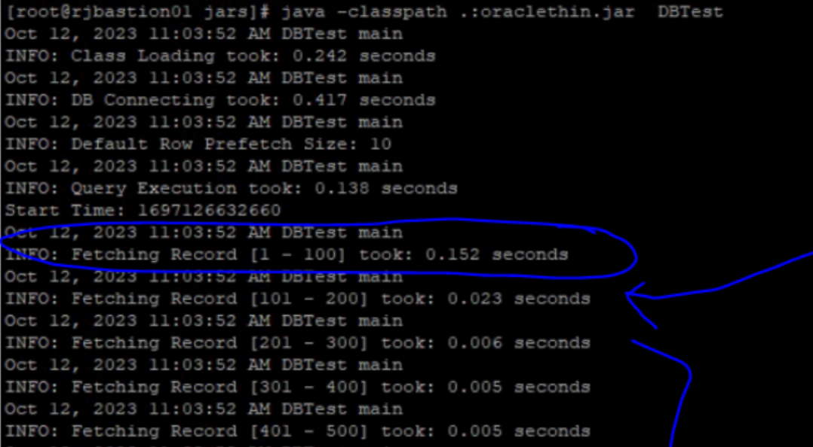

# DBTest Utility

**notes:** This utility requires **Java version 11 or higher**.

The DBTest Utility has two modes:
**Benchmark Mode:**(the default) is to measure database connection time, query execution time and data fetching time for every 100 records. 
**Query Mode:**(the default) is to display the query result with database connection time, query execution time and data fetching time. 


Here is an example demonstrating how to utilize this utility in the Maximo UI pod.

## Use DBTest in Maximo UI Pod

- go to maximo ui pod -> terminal tab, then execute below commands:

```bash
# change to /tmp
cd /tmp

# download DBTest
curl -L -v -o DBTest.class https://ibm-mas.github.io/mas-performance/pd/download/DBTest.class

# set DBURL. If this utility is in maximo UI pod, set DBURL="$MXE_DB_URL"
export DBURL='<jdbc url>' or export DBURL="$MXE_DB_URL"
export DBUSERNAME='<username>'
export DBPASSWORD='<password>'
export SQLQUERY='select * from maximo.maxattribute'

# execute the utility in benchmark mode
java -classpath .:$(dirname "$(find /opt/ibm | grep oraclethin | head -n 1)")/* DBTestjava
```

### Result Samples:



