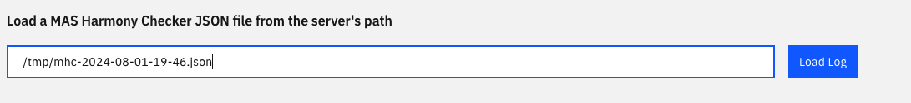

# Coming soon ...

!!! danger "Critical Note"
    **IBM Maximo Cluster Performance Insights is offered "AS IS", WITH NO WARRANTY OF ANY KIND, EITHER EXPRESS OR IMPLIED, INCLUDING THE WARRANTY OF TITLE, NON-INFRINGEMENT OR NON-INTERFERENCE AND THE IMPLIED WARRANTIES AND CONDITIONS OF MERCHANTABILITY AND FITNESS FOR A PARTICULAR PURPOSE.**

    The IBM Product Support you have purchased with your IBM Maximo Application Suite Product does not cover this Application extension. **Do not attempt to submit an IBM support ticket.**

    The IBM TechXChange Maximo Community discussions can be leveraged to crowd-source assistance from Maximo Experts.

### What is IBM Maximo Cluster Performance Insights

**IBM Maximo Cluster Performance Insights (Maximo CPI)**, is a new utility that use short and long term snapshots to addresses specific best practices for deployment of Maximo App Suite. It can assist in pinpointing areas that need improvement and provide actionable insights for optimizing the MAS deployment. 

Maximo Clients can conduct a self-assessment to ensure adherence to best practices, optimize resource use, and diagnose performance issues. This process helps in evaluating current practices, identifying areas for improvement, and enhancing overall efficiency and effectiveness.

The utility gathers only metrics data, excluding any sensitive information. It is containerized for ease of use.

### IBM Maximo Cluster Performance Insights Main Features

- Identify any missing or incorrect settings that not follows [MAS Best Practice](https://ibm-mas.github.io/mas-performance/mas/ocp/bestpractice/)
- Offer an in-depth evaluation of the deployed MAS system's performance
- Provide recommendations for minimizing the size of the MAS deployment to reduce infrastructure costs
- Identify certificates that have expired or are about to expire
- Provide suggestion for rebalancing the node resource utilization to optimize the workload
- Capacity to send a notification via slack
- Offer a platform for customized MAS Manage schedule scaling

### User guide

- **Run on Docker**
    - Download the docker container: `docker pull quay.io/brianzhu_ibm/mcpi:latest`
    - Run the docker container: `docker run -dit -p 8888:8888 --name mcpi quay.io/brianzhu_ibm/mcpi:latest`
    - Data Collection
        - enter into the docker container: `docker exec -it --user root mcpi bash`
        - login on OpenShift Cluster: `oc login https://<openshift-master-url>:<port> -u <username> -p <password>` or `oc login https://<openshift-master-url>:<port> --token=<token>`
        - execute data collection command: `collect-metric.sh`
        - **note:** when the command finishes executing, it returns the path to the MHC JSON file. Below is a sample of the returning. In this case, the path to the MHC JSON file is **/tmp/mhc-2024-08-01-19-36.json**
        
    - Data Review
        - launch the mcpi viewer url ([http://localhost:8888](http://localhost:8888)) in the browser 
        - review the data: Under **Load a MAS Harmony Checker JSON file from the server's path**, enter the path to the MHC JSON file e.g. **/tmp/mhc-2024-08-01-19-36.json** Below is the sample snapshot
        

- **Run on OpenShift Cluster**
    - Download [maximo-cpi-deployment.yamll](./maximo-cpi-deployment.yaml)
    - Login on OpenShift Cluster Console
    - Click + to import YAML, then Drag and drop maximo-cpi-deployment.yaml
    - Data Collection
        - login into the cluster console
        - go to **maximo-cpi** project
        - click on **mcpi-deployment-xxx** pod
        - go to **Terminal** tab
            - login on OpenShift Cluster: `oc login https://<openshift-master-url>:<port> -u <username> -p <password>` or `oc login https://<openshift-master-url>:<port> --token=<token>`
            - execute data collection command: `collect-metric.sh`
            - **note:** when the command finishes executing, it returns the path to the MHC JSON file. See the sample in the **Run on Docker** section
    - Data Review
        - go to **maximo-cpi** project -> Networking -> Routes
        - click on **mcpi-viewer-route** url
        - review the data: Under **Load a MAS Harmony Checker JSON file from the server's path**, enter the path to the MHC JSON file e.g. **/tmp/mhc-2024-08-01-19-36.json** See the sample in the **Run on Docker** section

### Most Common User Scenarios

#### 1) Best practice to minimizing footprint through Maximo CPI

- Step 1: Eliminate the surplus nodes if exist
- Step 2: Balance CPU and Memory Request%; Align CPU and Memory Requests to match hardware specifications, such as a ratio of 1:4 or 1:8.
- Step 3: Continuously reduce the resource requests for pods/containers to enhance utilization. Ideally, aim for resource utilization that exceeds the resource requests and approaches 60–70% of the cluster capacity.
- Repeat Step 1 – 3 if needed

#### 2) Best practice for performance troubleshooting and configuration checking

- Step 1: Heatmap viewer provides the problematic pods and nodes
- Step 2: Maximo CPI viewer provides the metric details 
- Step 3: Identify the severity and functional impacts
- Step 4: Vertically and horizontally adjust the pod/service/node and apply the recommended OpenShift Configuration if needed
- Repeat Step 1 – 4 if needed

#### 3) Rebalance Node Resource

- Issue Description: Observe the unbalance resource usage among the nodes. E.g. some nodes use 80% cpu, but the other uses 20% cpu. 
- Reason: Imbalanced placement OpenShift schedules the service / pod based on the resource cost increment , not the real resource usage. 
- Solution: migrate pods from busy nodes to non-busy nodes with min movements. This is a typical bin-packing (NP-Hard) problem. Maximo CPI uses the greedy algorithm since the time and minimum steps are not critical. 
- Actions:
    - execute **node-balance.sh**. The output will provide **movepod command** if any issue is detected
    - execute **movepod.sh** to move the pods.

#### 4) Scheduled Scaling

- modify mas-manage-scheduled-scaling-sample.sh to adjust the parameters e.g. time and pod replica number
- set up the slack url and channel name for notification if needed

#### 5) Expired and Expiring Certificate

- modify cert-expiration-slack-alert-sample.sh to adjust the paramenter e.g. time and expiration-in-days
- set up the slack url and channel name for notification if needed

### Upcoming
- Release this utility to the public via **IBM Accelerator**
- Extend metric collection to cover the database performance metrics
- Add and enhance the policies for alerting and best practices 
- Enhance MAS Optimization, Sizing, Re-balance, Scaling, Performance Diagnosis via AI technology
